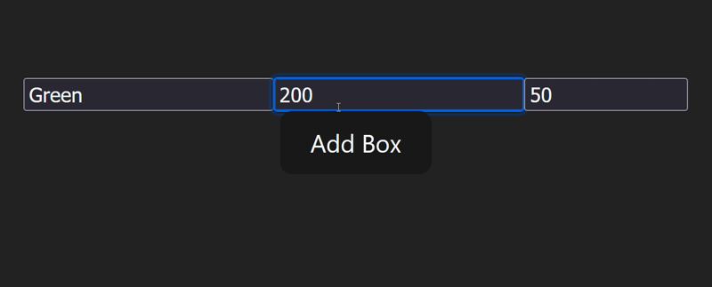

# Color Box Maker (Part 1)
**Demo**

### Create a new React application, which contains the following components:

***App***

this component should render the ***BoxList*** component.

***BoxList***

Place your state that contains all of the boxes here. This component should render all of the ***Box*** components along with the ***NewBoxForm*** component

***Box***

this component should display a ***div*** with a background color, width and height based on the props passed to it.

***NewBoxForm***

this component should render a form that when submitted, creates a new ***Box***. You should be able to specify the ***Box***’s width, height, and background color. When the form is submitted, clear the input values.